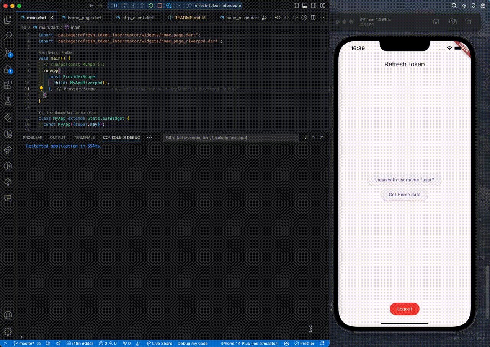

# RefreshTokenInterceptor

A Flutter package that provides an interceptor for Dio that automatically refreshes the token when it expires.

In this example there are two implementations of the interceptor, a simple one and one with Riverpod.

This example is related to my article on Medium: [How to create a RefreshTokenInterceptor in Flutter (with Dio)](https://medium.com/@dariovarrialeapps/how-to-create-a-refresh-token-interceptor-in-flutter-with-dio-64a3ab0be6fa)



## Getting Started

First, you need to install the dependencies:

```bash
flutter pub get
```

Then, choose a device and run the project:

```bash
flutter run
```

---

Inside the `main.dart` file, you can see that you can choose between the two implementations of the interceptor.

```dart
void main() {
  // runApp(const MyApp()); -> Simple implementation
  runApp( // Riverpod implementation
    const ProviderScope(
      child: MyAppRiverpod(),
    ),
  );
}
```

By default, the `MyAppRiverpod` is being used, but you can change it to `MyApp` to use the simple implementation.

Made with ❤️ by [Dario Varriale](https://www.linkedin.com/in/dario-varriale/)
